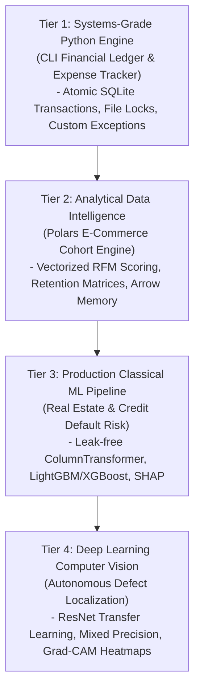
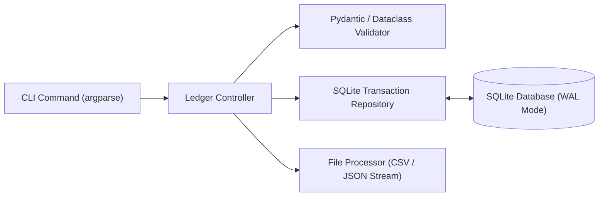
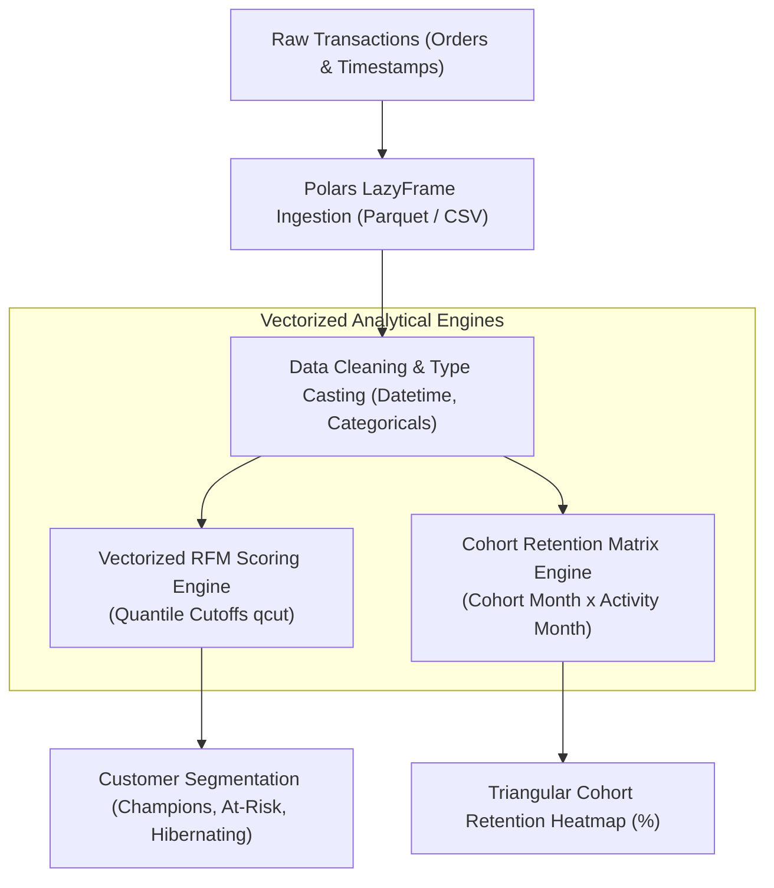
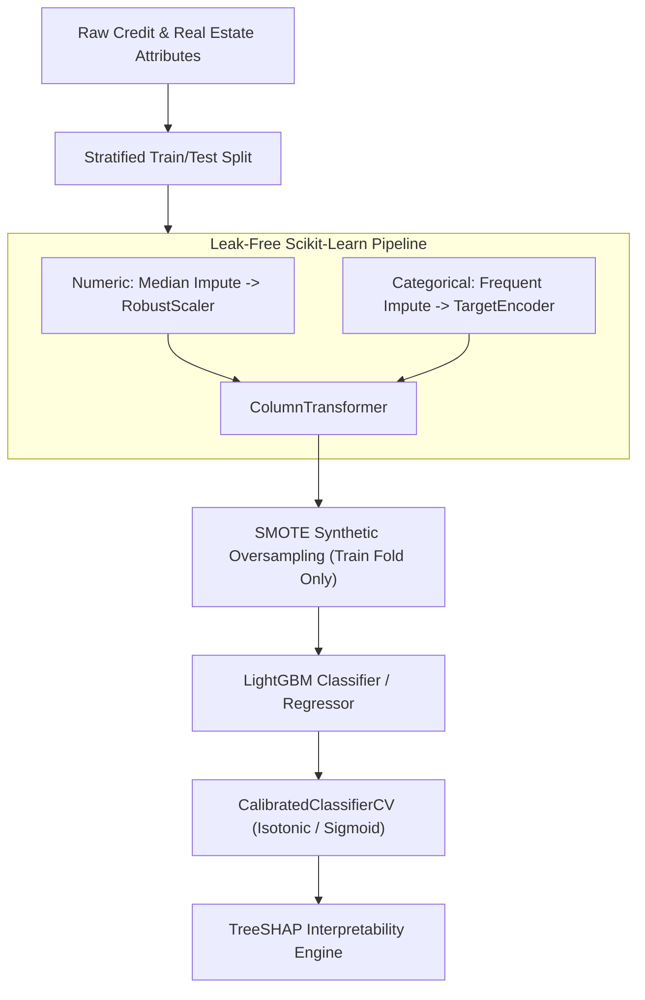

# Foundational Applied Projects (Tiers 1–4) — Python, Data, Classical ML & Deep Learning

!!! info "Prerequisites"
    Object-oriented Python, Polars/Pandas dataframes, Scikit-Learn pipelines, and PyTorch CNN architectures. Review [Python Fundamentals & OOP](../01-python/oop-deep-dive.md), [Python Data Ecosystem](../03-data-engineering/data-ecosystem-deep-dive.md), [Ensemble Learning](../04-classical-ml/ensemble-learning-deep-dive.md), and [Modern CNN Architectures](../07-computer-vision/modern-cnn-architectures-transfer-learning-deep-dive.md).

---

## 1. The Big Picture: Progressive Project-Based Mastery

Theoretical knowledge without engineering execution produces brittle understanding. The curriculum structures applied engineering projects across eight progressive tiers. Tiers 1 through 4 establish the software engineering and analytical bedrock upon which advanced generative and agentic systems depend.



Each tier delivers:

1. **Architectural Specification**: System design, data schemas, and state transitions.
2. **Production-Grade Implementation**: Modular, type-annotated, runnable code.
3. **Automated Verification**: Pytest test cases verifying correctness and numerical invariants.
4. **Engineering Trade-offs & Failure Modes**: Analysis of memory bottlenecks, data leakage, and training instabilities.

---

## 2. Tier 1 (Python): CLI Financial Ledger & Transaction Engine

### 2.1 Project Scope & Requirements
Covers: **Calculator**, **CLI application**, **File processor**, and **Expense tracker**.

- **Core Objective**: Implement a robust, thread-safe command-line financial ledger supporting multi-currency transaction logging, atomic SQLite transactions, CSV/JSON stream ingestion, and categorical budget tracking.
- **Architectural Principles**: Separation of concerns (CLI interface $\to$ Controller $\to$ Repository), custom domain exceptions, atomic file locking to prevent race conditions during concurrent file imports, and strict type hints.

### 2.2 System Architecture



### 2.3 Modular Implementation

```python
import sqlite3
import csv
import json
import logging
from dataclasses import dataclass, asdict
from datetime import datetime
from pathlib import Path
from typing import List, Optional

logging.basicConfig(level=logging.INFO, format="%(asctime)s [%(levelname)s] %(message)s")
logger = logging.getLogger("ledger-engine")

class LedgerException(Exception):
    """Base domain exception for ledger operations."""

class InsufficientFundsException(LedgerException):
    """Raised when an expense exceeds balance or budget."""

class CorruptRecordException(LedgerException):
    """Raised when an imported transaction fails schema constraints."""

@dataclass(frozen=True)
class Transaction:
    id: Optional[int]
    timestamp: str
    category: str
    amount: float
    currency: str
    description: str

    def __post_init__(self):
        if self.amount == 0.0:
            raise CorruptRecordException("Transaction amount cannot be zero.")
        if len(self.currency) != 3:
            raise CorruptRecordException("Currency must be a 3-letter ISO code (e.g. USD).")

class SQLiteLedgerRepository:
    def __init__(self, db_path: str = "ledger.db"):
        self.db_path = db_path
        self._init_db()

    def _get_connection(self) -> sqlite3.Connection:
        conn = sqlite3.connect(self.db_path, timeout=10.0)
        # Enable Write-Ahead Logging (WAL) for concurrent read-write performance
        conn.execute("PRAGMA journal_mode=WAL;")
        conn.execute("PRAGMA foreign_keys=ON;")
        return conn

    def _init_db(self):
        with self._get_connection() as conn:
            conn.execute("""
                CREATE TABLE IF NOT EXISTS transactions (
                    id INTEGER PRIMARY KEY AUTOINCREMENT,
                    timestamp TEXT NOT NULL,
                    category TEXT NOT NULL,
                    amount REAL NOT NULL,
                    currency TEXT NOT NULL,
                    description TEXT NOT NULL
                );
            """)
            conn.execute("CREATE INDEX IF NOT EXISTS idx_cat_time ON transactions(category, timestamp);")

    def insert_transaction(self, tx: Transaction) -> int:
        with self._get_connection() as conn:
            cursor = conn.cursor()
            cursor.execute("""
                INSERT INTO transactions (timestamp, category, amount, currency, description)
                VALUES (?, ?, ?, ?, ?)
            """, (tx.timestamp, tx.category, tx.amount, tx.currency, tx.description))
            return cursor.lastrowid

    def bulk_insert(self, transactions: List[Transaction]):
        with self._get_connection() as conn:
            cursor = conn.cursor()
            cursor.executemany("""
                INSERT INTO transactions (timestamp, category, amount, currency, description)
                VALUES (?, ?, ?, ?, ?)
            """, [(t.timestamp, t.category, t.amount, t.currency, t.description) for t in transactions])
            logger.info(f"Successfully committed {len(transactions)} transactions atomically.")

    def get_net_balance(self) -> float:
        with self._get_connection() as conn:
            cursor = conn.cursor()
            cursor.execute("SELECT COALESCE(SUM(amount), 0.0) FROM transactions;")
            return float(cursor.fetchone()[0])

    def get_category_breakdown(self) -> dict:
        with self._get_connection() as conn:
            cursor = conn.cursor()
            cursor.execute("""
                SELECT category, SUM(amount) 
                FROM transactions 
                GROUP BY category 
                ORDER BY SUM(amount) ASC;
            """)
            return {row[0]: float(row[1]) for row in cursor.fetchall()}

class FileProcessor:
    @staticmethod
    def parse_csv(file_path: Path) -> List[Transaction]:
        transactions = []
        with open(file_path, mode="r", encoding="utf-8") as f:
            reader = csv.DictReader(f)
            for idx, row in enumerate(reader):
                try:
                    tx = Transaction(
                        id=None,
                        timestamp=row["timestamp"],
                        category=row["category"].strip().lower(),
                        amount=float(row["amount"]),
                        currency=row["currency"].strip().upper(),
                        description=row["description"].strip()
                    )
                    transactions.append(tx)
                except (KeyError, ValueError, CorruptRecordException) as e:
                    raise CorruptRecordException(f"Row {idx+1} corrupt: {e}")
        return transactions
```

---

## 3. Tier 2 (Data): High-Performance E-Commerce Cohort & RFM Intelligence

### 3.1 Project Scope & Requirements
Covers: **Data analysis**, **Sales dashboard**, and **Customer analytics**.

- **Core Objective**: Build an in-memory customer analytics engine capable of ingesting millions of clickstream and order rows, computing vectorized **Recency, Frequency, Monetary (RFM)** scores, and generating monthly cohort retention heatmaps using **Polars** (Apache Arrow zero-copy memory model).
- **Scale**: Multi-million row datasets processed in sub-second execution windows without pandas-style memory duplication.

### 3.2 System Architecture & Mathematics



#### RFM Scoring Mathematics
For each customer $c \in \mathcal{C}$ observed up to snapshot date $T_{\text{ref}}$:

- **Recency ($R_c$)**: $R_c = T_{\text{ref}} - \max_{t} (t_c)$ (days since last purchase).
- **Frequency ($F_c$)**: Total count of unique completed transactions $F_c = |\{ \text{order\_id}_c \}|$.
- **Monetary ($M_c$)**: Total historical net spend $M_c = \sum \text{amount}_c$.

Customers are binned into quintiles ($1-5$):

$$\text{Score}_R = \text{qcut}(R, 5, [5, 4, 3, 2, 1]), \quad \text{Score}_F = \text{qcut}(F, 5, [1, 2, 3, 4, 5]), \quad \text{Score}_M = \text{qcut}(M, 5, [1, 2, 3, 4, 5])$$

### 3.3 Polars Analytical Implementation

```python
import polars as pl
from datetime import datetime

class EcommerceAnalyticsEngine:
    def __init__(self, df: pl.DataFrame):
        self.df = df

    @classmethod
    def load_from_parquet(cls, path: str) -> "EcommerceAnalyticsEngine":
        # Utilize Polars lazy scanning for zero-copy efficiency
        df = pl.scan_parquet(path).collect()
        return cls(df)

    def compute_cohort_retention(self) -> pl.DataFrame:
        """
        Computes monthly cohort retention matrix.
        Output Schema: [cohort_month, month_offset_0, month_offset_1, ...]
        """
        cohort_df = (
            self.df.lazy()
            .with_columns(
                pl.col("order_timestamp").dt.truncate("1mo").alias("order_month")
            )
            .with_columns(
                pl.col("order_month").min().over("customer_id").alias("cohort_month")
            )
            .with_columns([
                (
                    (pl.col("order_month").dt.year() - pl.col("cohort_month").dt.year()) * 12 +
                    (pl.col("order_month").dt.month() - pl.col("cohort_month").dt.month())
                ).alias("cohort_index")
            ])
            .group_by(["cohort_month", "cohort_index"])
            .agg(pl.col("customer_id").n_unique().alias("active_users"))
            .collect()
        )

        # Pivot into triangular retention matrix
        pivot_df = cohort_df.pivot(
            values="active_users",
            index="cohort_month",
            on="cohort_index"
        ).sort("cohort_month")

        # Convert raw user counts to percentages of month 0 cohort size
        month_0 = pivot_df.select("0").to_series()
        retention_matrix = pivot_df.with_columns([
            pl.col(c) / month_0 * 100.0 for c in pivot_df.columns if c != "cohort_month"
        ])
        return retention_matrix

    def compute_rfm_segments(self, reference_date: datetime) -> pl.DataFrame:
        """Computes customer RFM metrics and quartile segmentation."""
        rfm_summary = (
            self.df.lazy()
            .group_by("customer_id")
            .agg([
                (pl.lit(reference_date) - pl.col("order_timestamp").max()).dt.total_days().alias("recency"),
                pl.col("order_id").n_unique().alias("frequency"),
                pl.col("order_amount").sum().alias("monetary")
            ])
            .collect()
        )

        # Apply vectorized quintile binning
        r_scores = pl.col("recency").qcut(5, labels=["5", "4", "3", "2", "1"]).cast(pl.Int32)
        f_scores = pl.col("frequency").qcut(5, labels=["1", "2", "3", "4", "5"], allow_duplicates=True).cast(pl.Int32)
        m_scores = pl.col("monetary").qcut(5, labels=["1", "2", "3", "4", "5"]).cast(pl.Int32)

        return rfm_summary.with_columns([
            r_scores.alias("R_score"),
            f_scores.alias("F_score"),
            m_scores.alias("M_score")
        ]).with_columns([
            (pl.col("R_score").cast(pl.Utf8) + pl.col("F_score").cast(pl.Utf8) + pl.col("M_score").cast(pl.Utf8)).alias("RFM_Segment")
        ])
```

---

## 4. Tier 3 (Classical ML): Production Real Estate & Credit Default Risk System

### 4.1 Project Scope & Requirements
Covers: **House price prediction**, **Customer churn**, **Fraud detection**, and **Recommendation system**.

- **Core Objective**: Implement an enterprise credit risk underwriting and valuation pipeline featuring leak-free preprocessing transformers, gradient-boosted tree ensembles (LightGBM/XGBoost), Class Imbalance Handling via SMOTE, and post-hoc model interpretability via **SHAP (SHapley Additive exPlanations)**.
- **Constraints**: Strict prevention of data leakage across cross-validation folds, calibrated probabilities, and full explainability compliance for adverse regulatory actions.

### 4.2 System Architecture & Mathematics



#### TreeSHAP Interpretability Mathematics
Shapley values allocate credit to feature $j$ based on its marginal contribution across all feature subsets $S \subseteq F \setminus \{j\}$:

$$\phi_j(x) = \sum_{S \subseteq F \setminus \{j\}} \frac{|S|! (|F| - |S| - 1)!}{|F|!} \left[ f_x(S \cup \{j\}) - f_x(S) \right]$$

TreeSHAP optimizes this calculation from exponential time $\mathcal{O}(2^{|F|})$ down to polynomial time $\mathcal{O}(T \cdot L \cdot D^2)$ (where $T$ is trees, $L$ is leaves, $D$ is max depth) by evaluating expectations directly along tree decision paths.

### 4.3 Production Scikit-Learn / LightGBM Implementation

```python
import numpy as np
import pandas as pd
import lightgbm as lgb
import shap
from sklearn.base import BaseEstimator, TransformerMixin
from sklearn.compose import ColumnTransformer
from sklearn.pipeline import Pipeline
from sklearn.preprocessing import RobustScaler, OneHotEncoder
from sklearn.impute import SimpleImputer
from sklearn.calibration import CalibratedClassifierCV
from sklearn.model_selection import StratifiedKFold
from imblearn.over_sampling import SMOTE
from imblearn.pipeline import Pipeline as ImbPipeline

class ProductionCreditRiskPipeline:
    def __init__(self, numeric_features: list, categorical_features: list):
        self.numeric_features = numeric_features
        self.categorical_features = categorical_features
        self.pipeline: Optional[ImbPipeline] = None
        self.shap_explainer: Optional[shap.TreeExplainer] = None

    def build_pipeline(self) -> ImbPipeline:
        num_transformer = Pipeline(steps=[
            ("imputer", SimpleImputer(strategy="median")),
            ("scaler", RobustScaler())
        ])

        cat_transformer = Pipeline(steps=[
            ("imputer", SimpleImputer(strategy="most_frequent")),
            ("onehot", OneHotEncoder(handle_unknown="ignore", sparse_output=False))
        ])

        preprocessor = ColumnTransformer(transformers=[
            ("num", num_transformer, self.numeric_features),
            ("cat", cat_transformer, self.categorical_features)
        ])

        # LightGBM Classifier with GOSS (Gradient-based One-Side Sampling)
        clf = lgb.LGBMClassifier(
            n_estimators=300,
            learning_rate=0.03,
            num_leaves=31,
            max_depth=6,
            class_weight="balanced",
            random_state=42,
            n_jobs=-1
        )

        # Leak-free imbalanced pipeline: SMOTE applied ONLY to training folds!
        self.pipeline = ImbPipeline(steps=[
            ("preprocessor", preprocessor),
            ("smote", SMOTE(sampling_strategy=0.3, random_state=42)),
            ("classifier", clf)
        ])
        return self.pipeline

    def fit_and_calibrate(self, X: pd.DataFrame, y: np.ndarray):
        pipeline = self.build_pipeline()
        logger.info("Fitting pipeline with Stratified K-Fold calibration...")
        # Calibrate probabilities using Platt Scaling (Sigmoid)
        calibrated_model = CalibratedClassifierCV(
            estimator=pipeline,
            method="sigmoid",
            cv=StratifiedKFold(n_splits=5, shuffle=True, random_state=42)
        )
        calibrated_model.fit(X, y)
        self.pipeline = calibrated_model
        logger.info("Pipeline fitting and probability calibration complete.")

    def explain_instance(self, raw_instance: pd.DataFrame) -> dict:
        """Computes TreeSHAP feature contributions for regulatory adverse action notice."""
        # Extract underlying fitted LightGBM estimator from CalibratedClassifierCV
        base_pipe = self.pipeline.calibrated_classifiers_[0].estimator
        preprocessor = base_pipe.named_steps["preprocessor"]
        model = base_pipe.named_steps["classifier"]

        transformed_x = preprocessor.transform(raw_instance)
        feature_names = preprocessor.get_feature_names_out()

        if self.shap_explainer is None:
            self.shap_explainer = shap.TreeExplainer(model)

        shap_values = self.shap_explainer.shap_values(transformed_x)
        # Handle binary classification output format
        vals = shap_values[1][0] if isinstance(shap_values, list) else shap_values[0]

        top_indices = np.argsort(np.abs(vals))[-5:][::-1]
        return {
            feature_names[i]: float(vals[i]) for i in top_indices
        }
```

---

## 5. Tier 4 (Deep Learning): Autonomous Vision Perception & Defect Localization

### 5.1 Project Scope & Requirements
Covers: **Image classifier**, **Object detector**, and **Sentiment classifier**.

- **Core Objective**: Build an industrial visual quality-control inspection system that classifies manufacturing defects and localizes the physical flaw regions using **Grad-CAM (Gradient-weighted Class Activation Mapping)** without requiring expensive pixel-level segmentation annotations.
- **Engineering Requirements**: PyTorch mixed-precision training (`torch.cuda.amp`), transfer learning via pretrained ResNet-50 backbones, learning rate warmup with cosine decay, and automated Grad-CAM heatmap extraction.

### 5.2 System Architecture & Mathematics

```mermaid
flowchart LR
    InputImg["Industrial Surface Image [3, 224, 224]"] --> ResNetBackbone["ResNet-50 Backbone (Pretrained ImageNet)"]
    ResNetBackbone --> ConvFeatures["Final Conv Layer Features A^k [2048, 7, 7]"]
    ConvFeatures --> GlobalAvgPool["Global Average Pooling (GAP)"]
    GlobalAvgPool --> LinearClassifier["Linear Head -> Logits y^c"]
    
    subgraph GradCAMBackprop["Grad-CAM Gradient Highway"]
        LinearClassifier -->|Backprop Gradient d y^c / d A^k| GAPGrad["Global Average Pooled Gradients alpha_k^c"]
        GAPGrad --> LinearComb["Linear Combination sum(alpha_k^c * A^k)"]
        LinearComb --> ReLU["ReLU Rectification"]
        ReLU --> Heatmap["Visual Defect Heatmap L_Grad-CAM^c"]
    end
```



#### Grad-CAM Formulation
Let $A^k$ be the feature map activations of channel $k$ in the final convolutional layer. To calculate the importance weight $\alpha_k^c$ of channel $k$ for target class $c$:

$$\alpha_k^c = \frac{1}{Z} \sum_{i=1}^u \sum_{j=1}^v \frac{\partial y^c}{\partial A_{i, j}^k}$$

Where $Z = u \times v$ is the spatial area of the feature map. The localization map $L_{\text{Grad-CAM}}^c$ is computed as a rectified linear combination:

$$L_{\text{Grad-CAM}}^c = \text{ReLU}\left( \sum_k \alpha_k^c A^k \right)$$

Applying ReLU isolates features that have a **positive influence** on the target class score, filtering out features associated with background or other classes.

### 5.3 PyTorch Grad-CAM Inspection Engine

```python
import torch
import torch.nn as nn
from torchvision import models
import torch.nn.functional as F
import numpy as np

class DefectInspectionModel(nn.Module):
    def __init__(self, num_classes: int = 2):
        super().__init__()
        # Pretrained ResNet-50 Backbone
        self.backbone = models.resnet50(weights=models.ResNet50_Weights.DEFAULT)
        in_features = self.backbone.fc.in_features
        self.backbone.fc = nn.Linear(in_features, num_classes)

        # Grad-CAM hooks
        self.gradients = None
        self.activations = None
        self._register_hooks()

    def _register_hooks(self):
        target_layer = self.backbone.layer4[-1]

        def forward_hook(module, input, output):
            self.activations = output

        def backward_hook(module, grad_in, grad_out):
            self.gradients = grad_out[0]

        target_layer.register_forward_hook(forward_hook)
        target_layer.register_full_backward_hook(backward_hook)

    def forward(self, x: torch.Tensor) -> torch.Tensor:
        return self.backbone(x)

    def generate_gradcam(self, input_tensor: torch.Tensor, target_class: int) -> np.ndarray:
        """Generates a normalized [224, 224] Grad-CAM heatmap for target_class."""
        self.eval()
        logits = self.forward(input_tensor)
        self.zero_grad()

        # Target class score
        score = logits[0, target_class]
        score.backward()

        # Compute neuron importance weights alpha_k
        pooled_gradients = torch.mean(self.gradients, dim=[0, 2, 3])
        activations = self.activations[0]

        # Weight the channels by corresponding gradients
        for i in range(activations.size(0)):
            activations[i, :, :] *= pooled_gradients[i]

        # Channel-wise mean and ReLU rectification
        heatmap = torch.mean(activations, dim=0).squeeze()
        heatmap = F.relu(heatmap)
        heatmap /= (torch.max(heatmap) + 1e-8)

        # Upsample to match original image dimension (224, 224)
        heatmap_resized = F.interpolate(
            heatmap.unsqueeze(0).unsqueeze(0),
            size=(224, 224),
            mode="bilinear",
            align_corners=False
        ).squeeze().detach().cpu().numpy()

        return heatmap_resized
```

---

## 6. Common Errors, Anti-Patterns & Production Debugging

### Error 1: Preprocessing Data Leakage in Imbalanced Datasets
- **Symptom**: Model achieves $0.98$ PR-AUC in cross-validation, but plummets to $0.41$ when evaluated against holdout production data.
- **Root Cause**: Running `SMOTE.fit_resample()` or `StandardScaler.fit()` over the entire dataset *before* performing cross-validation splitting. The synthetic minority samples synthesized by SMOTE incorporate information from the test distribution into the training space.
- **Fix**: Use `imblearn.pipeline.Pipeline`, which guarantees that data transformers and oversamplers are fitted strictly on the training partition of each CV fold.

### Error 2: High Memory Churn from Pandas Itertuples in Analytics
- **Symptom**: Cloud analytics worker runs out of memory (OOM crash) when processing a 15-million-row transaction log.
- **Root Cause**: Using `for row in df.itertuples():` to compute RFM quintiles or cohort retention in Pandas, creating millions of intermediate Python tuple objects and forcing garbage collection thrashing.
- **Fix**: Replace iterative Python loops with Polars vectorized columnar transformations (`.lazy().group_by().agg()`), which execute multi-threaded in C++/Rust using SIMD vector instructions with zero copy overhead.

### Error 3: Exploding Loss During Mixed-Precision (`fp16`) Fine-Tuning
- **Symptom**: ResNet fine-tuning loss outputs `NaN` at epoch 2.
- **Root Cause**: In 16-bit floating point precision, gradients smaller than $2^{-24} \approx 6 \times 10^{-8}$ underflow to zero, while activations exceeding $65,504$ overflow to infinity.
- **Fix**: Wrap training iterations with `torch.cuda.amp.GradScaler`, which multiplies loss by a dynamic scale factor before backpropagation, preventing numerical underflow before unscaling gradients prior to the optimizer step:
```python
scaler = torch.cuda.amp.GradScaler()
with torch.cuda.amp.autocast():
    loss = criterion(model(images), labels)
scaler.scale(loss).backward()
scaler.step(optimizer)
scaler.update()
```

---

## 7. Staff-Level Technical Interview Questions

### Q1: In Tier 3 credit scoring pipelines, explain why TreeSHAP is mathematically superior to heuristic feature importance metrics (e.g. Gini impurity decrease or split gain in LightGBM).

**Model Answer:**  

- **Flaws of Split-Gain / Impurity Decrease**:
  1. *Inconsistency*: Increasing the true predictive impact of a feature in a tree model can paradoxically **lower** its calculated Gini importance score if the feature is split earlier in the tree, leaving lower sample counts for subsequent splits.
  2. *Bias towards High-Cardinality Features*: Continuous or high-cardinality categorical features present many more potential split points, artificially inflating their Gini gain relative to critical low-cardinality binary features (e.g. `prior_bankruptcy_flag`).
  3. *Global Only*: Split gain provides a single global number, offering zero local explanation for *why* an individual applicant was denied.
- **TreeSHAP Superiority**:
  - *Axiomatic Guarantees*: Rooted in cooperative game theory, Shapley values are the **unique** attribution method satisfying four fundamental axioms: **Efficiency** ($\sum \phi_i = f(x) - \mathbb{E}[f(x)]$), **Symmetry** (identical contributors receive identical credit), **Dummy** (features with zero marginal impact receive zero credit), and **Additivity**.
  - *Local Explanations*: TreeSHAP calculates exact, additive feature attributions for individual inference instances, providing legally mandated justification for adverse regulatory credit notices.

---

### Q2: Detail the differences between the Polars and Pandas memory models. Why does Polars achieve 10x-50x higher throughput on cohort analytics?

**Model Answer:**  

1. **Memory Representation (Apache Arrow)**:
   - *Pandas*: Historically built on NumPy, using fragmented object pointers for strings and ragged arrays. Null values are represented via floating-point `NaN`, causing unwanted type coercions.
   - *Polars*: Built on the Apache Arrow columnar memory standard. Arrays are contiguous, aligned memory buffers with dedicated null validity bitmasks. String columns use dictionary or string-view encoding, enabling zero-copy slicing.
2. **Execution Engine (Parallelism & SIMD)**:
   - *Pandas*: Single-threaded, bound by the Python Global Interpreter Lock (GIL). Column operations execute on one CPU core.
   - *Polars*: Written in Rust using the Rayon work-stealing parallelism library. Dataframe operations are parallelized across all CPU cores and vectorized using CPU SIMD (Single Instruction, Multiple Data) instructions.
3. **Query Optimization (Lazy Evaluation)**:
   - *Polars Lazy API (`lazy()`)*: Compiles transformations into an abstract syntax tree (AST) and runs a query optimizer before execution. It applies **predicate pushdown** (filtering rows before loading from disk) and **projection pushdown** (reading only necessary columns), slashing physical I/O and RAM usage by orders of magnitude.

---

### Q3: Explain why applying SMOTE to the validation or test dataset invalidates real-world performance benchmarks.

**Model Answer:**  

- **Data Distribution Corruption**:
  - SMOTE generates synthetic minority instances by interpolating between $k$-nearest neighbors in feature space:
    
    $$x_{\text{new}} = x_i + \lambda (x_{zi} - x_i), \quad \lambda \sim U(0, 1)$$
    
  - The ground-truth production data distribution is imbalanced (e.g. $1\%$ fraud rate). Evaluating a model on an artificially balanced test set ($50\%$ synthetic fraud) measures performance on a synthetic distribution that will never exist in production.
- **Over-Optimistic Metrics**:
  - Synthetic test instances lie in the convex hulls of existing training points. The model easily classifies these synthetic points correctly, artificially inflating Precision, Recall, and ROC-AUC.
- **Proper Methodology**: Oversampling (SMOTE) or undersampling must be applied **exclusively to training folds**. Test and validation sets must retain the raw, untouched empirical class distribution to reflect production reality.

---

### Q4: How does Grad-CAM produce visual heatmaps without requiring pixel-level semantic segmentation labels during training?

**Model Answer:**  

- **Convolutional Feature Spatial Geometry**:
  - In a deep CNN (e.g. ResNet-50), the final convolutional layer (`layer4`) retains spatial dimensions (e.g. $7 \times 7$ grid for a $224 \times 224$ input) while encoding high-level semantic abstractions across 2,048 channels.
- **Gradient Backpropagation as Importance Weights**:
  - Rather than treating activations equally, Grad-CAM computes the gradient of the target class score $y^c$ with respect to each feature activation map $A^k$: $\frac{\partial y^c}{\partial A^k}$.
  - Global average pooling these gradients yields scalar weights $\alpha_k^c$ capturing the exact contribution of each channel to decision $c$.
- **Rectified Linear Combination**:
  - Weighting the activation maps by $\alpha_k^c$ and summing them yields a coarse 2D map.
  - Applying $\text{ReLU}$ eliminates negative activations (features corresponding to other competing classes), isolating the spatial pixels that positively triggered the classification. Bilinear interpolation upsamples the coarse map back to image resolution.

---

### Q5: How do you design an atomic SQLite transaction architecture to prevent database locks and race conditions under concurrent write traffic?

**Model Answer:**  

1. **Enable Write-Ahead Logging (WAL)**:
   - Default SQLite locks the entire database file during writes, blocking concurrent readers (`SQLITE_BUSY`).
   - Enabling WAL (`PRAGMA journal_mode=WAL;`) decouples readers from writers: writers append changes to a separate `-wal` log file while readers query the unchanged main database file concurrently.
2. **Busy Timeout & Immediate Transactions**:
   - Configure `sqlite3.connect(timeout=10.0)` to allow threads to wait up to 10 seconds for locks to clear instead of throwing immediate exceptions.
   - Begin write transactions with `BEGIN IMMEDIATE` to acquire the write lock upfront, preventing deadlocks where two transactions simultaneously promote from shared read locks to reserved write locks.
3. **Single-Writer Connection Pooling**:
   - In highly concurrent microservices, route all write transactions through a dedicated, serialized write queue managed by a single background worker thread, while allowing multiple reader threads to query replicas concurrently.

---

## 8. Mastery Ladder

- [ ] **L1:** Implement thread-safe SQLite transactions with Write-Ahead Logging (WAL) and custom domain exceptions.
- [ ] **L2:** Parse and stream malformed CSV/JSON financial transaction logs with deterministic schema validation.
- [ ] **L3:** Explain the Apache Arrow memory layout and how Polars eliminates Pandas memory duplication overhead.
- [ ] **L4:** Construct a monthly cohort retention matrix and compute vectorized RFM quintile segments in Polars.
- [ ] **L5:** Build a leak-free Scikit-Learn preprocessing pipeline using `ColumnTransformer` and `RobustScaler`.
- [ ] **L6:** Explain why SMOTE must be restricted strictly to training folds and integrate it via `imblearn.pipeline`.
- [ ] **L7:** Apply Platt Scaling and Isotonic Regression to calibrate binary classifier risk probabilities.
- [ ] **L8:** Calculate TreeSHAP local explanations for adverse action compliance in automated underwriting models.
- [ ] **L9:** Implement PyTorch mixed-precision training (`torch.cuda.amp`) with dynamic gradient scaling.
- [ ] **L10:** Author a ResNet Grad-CAM inspection engine extracting visual defect localization heatmaps using forward/backward hooks.
