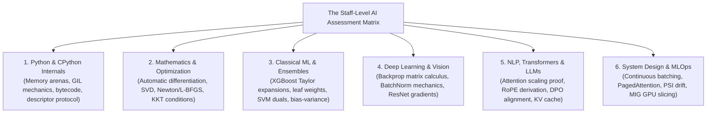
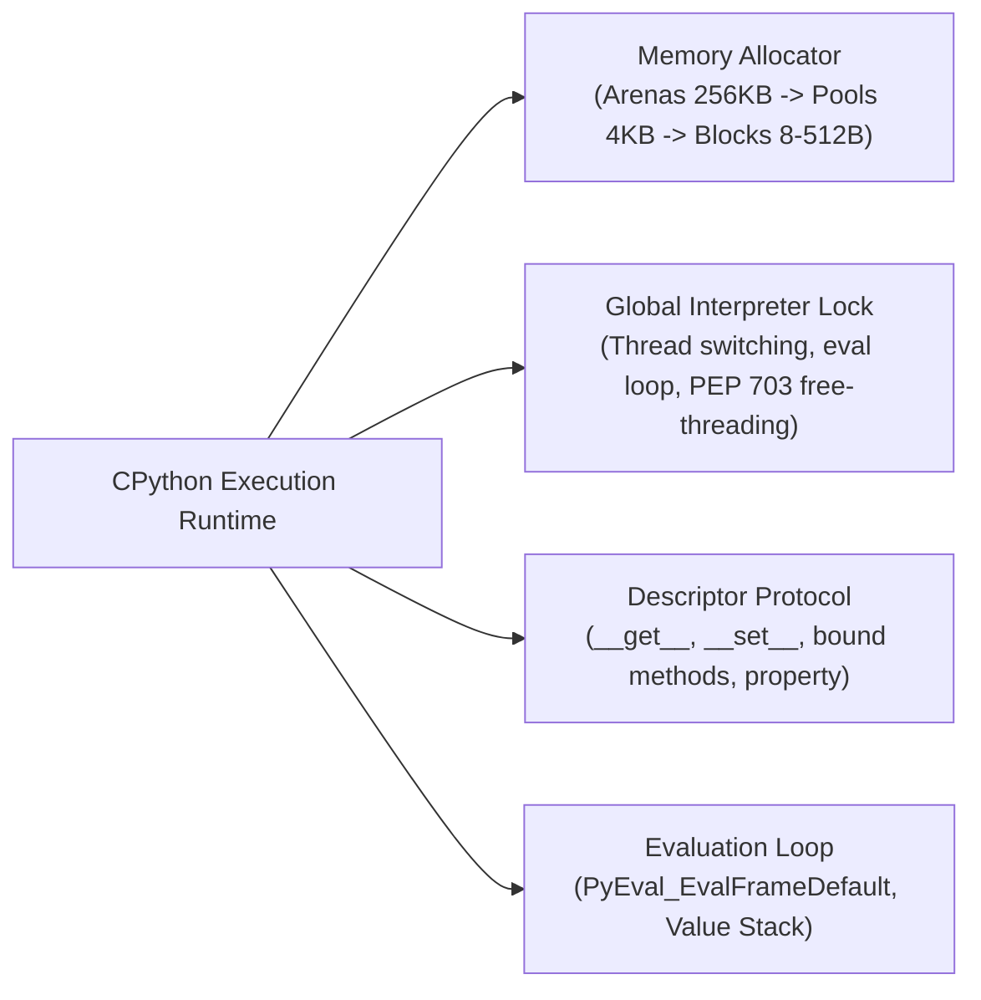
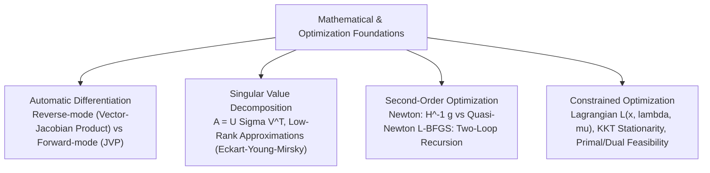
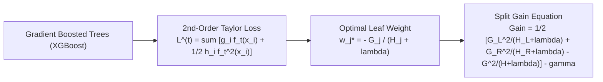
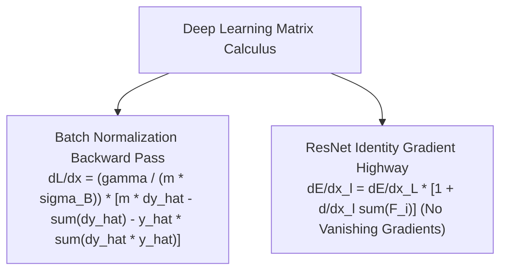
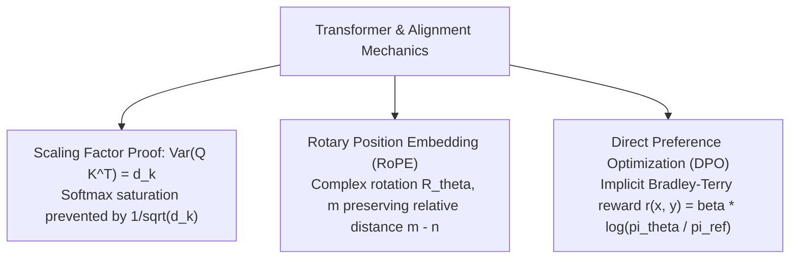
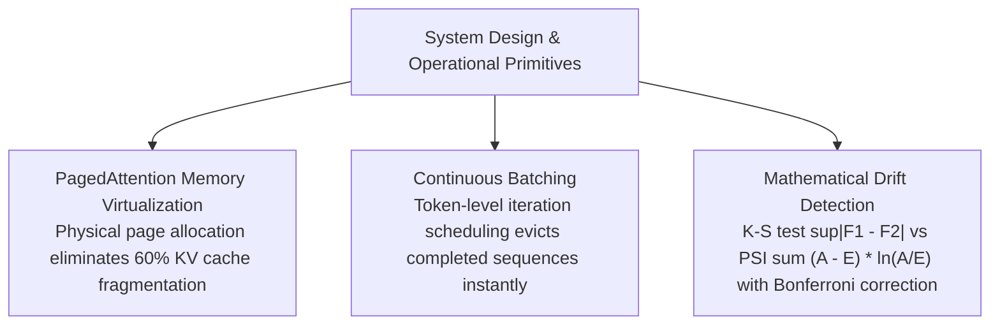

# Staff-Level Technical Interview Question Banks — Foundations to Production AI

!!! info "Prerequisites"
    Comprehensive knowledge spanning Books 0 through 13: Computer Science, CPython internals, linear algebra, multivariable optimization, tree ensembles, neural network backpropagation, transformers, LLM alignment, distributed serving, and MLOps.

---

## 1. The Big Picture: What Distinguishes Staff-Level AI Engineers?

In Tier-1 AI labs and enterprise infrastructure teams, technical interviews for Staff, Principal, and Lead AI Engineers do not focus on trivia or boilerplate library API calls (`model.fit()`, `import langchain`). Instead, staff-level evaluations probe **depth of first principles**, **mathematical rigor**, **systems-level intuition**, and **architectural trade-offs**.

This question bank provides exhaustive, mathematically rigorous model answers covering the most demanding technical questions asked in FAANG, top AI research labs, and hyperscalers.

---

## 2. Domain 1: Python & CPython Internals

### Q1.1: Describe the internal memory architecture of CPython's `PyMalloc`. How does it mitigate memory fragmentation, and what happens when an object exceeds 512 bytes?

**Model Answer:**  
CPython bypasses the operating system's standard `malloc()` for small object allocations ($\le 512\text{ bytes}$) via **PyMalloc**, a specialized three-tier hierarchical slab allocator designed to eliminate heap fragmentation and minimize syscall overhead:

1. **Arenas ($256\text{ KB}$)**:
   - PyMalloc requests large $256\text{ KB}$ contiguous chunks of virtual memory directly from the OS kernel using `mmap()` (or `VirtualAlloc()` on Windows).
   - Arenas track their constituent pools via a doubly linked list. An arena is freed back to the OS kernel *only* when all of its 64 pools become completely empty.
2. **Pools ($4\text{ KB}$)**:
   - Each arena is partitioned into 64 pools of $4\text{ KB}$ each (matching the hardware MMU virtual memory page size).
   - Every pool is dedicated to a single **size class**. Size classes span $8\text{ bytes}$ to $512\text{ bytes}$ in steps of $8\text{ bytes}$ (64 distinct size classes: $8, 16, 24, \dots, 512\text{ bytes}$).
   - A pool maintains a singly linked free-list of available blocks.
3. **Blocks ($8 - 512\text{ bytes}$)**:
   - When an object of size $S$ is allocated (e.g. a small tuple or float), PyMalloc rounds $S$ up to the nearest multiple of 8, locates an active pool matching that size class, and pops the head block off the pool's free list in $\mathcal{O}(1)$ time with zero kernel context switches.
- **Objects Exceeding 512 Bytes**:
  - Any allocation $> 512\text{ bytes}$ bypasses PyMalloc entirely and is delegated directly to the system allocator (`malloc()`). Large memory blocks (such as NumPy multidimensional array buffers or PyTorch tensor storages) are allocated on the unmanaged system heap.

---

### Q1.2: How does the Global Interpreter Lock (GIL) function at the C level, and how does PEP 703 (Python 3.13 free-threading) remove it safely?

**Model Answer:**  

- **CPython GIL Mechanics**:
  - The GIL is an OS-level mutual exclusion lock (`PyMutex` or `pthread_mutex_t`) guarding CPython’s global interpreter state.
  - In `ceval.c`, the main execution loop (`_PyEval_EvalFrameDefault`) executes bytecode instructions. To prevent race conditions in reference counting (`Py_INCREF`/`Py_DECREF`) and mutable runtime dicts, an OS thread must hold the GIL to execute bytecode.
  - Periodic thread switching is governed by `sys.getswitchinterval()` (default $5\text{ ms}$). Every 5 milliseconds, the active thread is forced to release the GIL, signaling waiting threads via a condition variable. Under CPU-bound multi-threading, threads experience high lock contention ("GIL convoy effect"), degrading multi-core performance.
- **PEP 703 (Free-Threaded CPython)**:
  - PEP 703 removes the GIL by replacing global locking with three fine-grained concurrency primitives:
    1. *Biased Reference Counting*: Objects are biased toward the thread that allocated them. Local increments/decrements require no atomic instructions. Cross-thread modifications use atomic CAS (Compare-And-Swap) operations.
    2. *Immortal Objects*: Core singletons (`None`, `True`, `False`, small integers) have their reference count flag set to immortal, eliminating cache-line bouncing across CPU cores.
    3. *Thread-Safe Allocator (mimalloc)*: Replaces PyMalloc with Microsoft’s lock-free `mimalloc` memory allocator.

---

### Q1.3: Explain the Python Descriptor Protocol. How do `@property`, `classmethod`, and regular bound methods utilize it under the hood?

**Model Answer:**  
A descriptor is any Python object defining at least one of the protocol methods: `__get__(self, obj, type=None)`, `__set__(self, obj, value)`, or `__delete__(self, obj)`.

- **Attribute Lookup Precedence**: When evaluating `obj.attr`:
  1. If `attr` is a **Data Descriptor** (defines `__set__` or `__delete__`), the descriptor's `__get__` is invoked, overriding `obj.__dict__`.
  2. If `attr` exists in instance dictionary `obj.__dict__`, the instance value is returned.
  3. If `attr` is a **Non-Data Descriptor** (defines only `__get__`), the descriptor's `__get__` is invoked.
  4. Finally, standard class dictionary `type(obj).__dict__` lookup occurs before raising `AttributeError`.
- **Mechanisms Under the Hood**:
  - **Bound Methods**: In Python, functions are non-data descriptors. When function `foo` is accessed via `instance.foo`, `FunctionType.__get__(foo, instance, Class)` is called. It returns a `MethodType` closure object that binds `instance` to the first argument (`self`).
  - **`@property`**: A data descriptor wrapping getter, setter, and deleter callables. Because it implements `__set__`, it takes precedence over the instance dictionary.

---

## 3. Domain 2: Mathematics & Numerical Optimization

### Q2.1: Derive Reverse-Mode Automatic Differentiation (Backpropagation) using Vector-Jacobian Products (VJPs). Why is it computationally superior to Forward-Mode for deep neural networks?

**Model Answer:**  
Consider a composite function $f: \mathbb{R}^n \to \mathbb{R}^m$ expressed as a chain of $L$ intermediate vector operations:

$$\mathbf{x}_0 \xrightarrow{\phi_1} \mathbf{x}_1 \xrightarrow{\phi_2} \dots \xrightarrow{\phi_L} \mathbf{x}_L$$

By the multivariate chain rule, the total Jacobian $\mathbf{J} \in \mathbb{R}^{m \times n}$ is the matrix product of local Jacobians:

$$\mathbf{J} = \frac{\partial \mathbf{x}_L}{\partial \mathbf{x}_0} = \mathbf{J}_L \mathbf{J}_{L-1} \dots \mathbf{J}_1 \quad \text{where} \quad \mathbf{J}_i = \frac{\partial \mathbf{x}_i}{\partial \mathbf{x}_{i-1}} \in \mathbb{R}^{n_i \times n_{i-1}}$$

- **Forward-Mode AD (Jacobian-Vector Products - JVPs)**:
  - Evaluates associative matrix multiplications from right to left: $((\mathbf{J}_L (\dots (\mathbf{J}_2 (\mathbf{J}_1 \mathbf{v})))))$.
  - Propagates perturbations forward: $\dot{\mathbf{x}}_i = \mathbf{J}_i \dot{\mathbf{x}}_{i-1}$.
  - To compute the full gradient for a scalar loss ($m = 1$) with $n$ parameters, forward-mode requires **$n$ independent forward sweeps** (one per coordinate basis vector $\mathbf{e}_k$), scaling as $\mathcal{O}(n)$.
- **Reverse-Mode AD (Vector-Jacobian Products - VJPs)**:
  - Evaluates associative matrix multiplications from left to right: $(((( \mathbf{u}^T \mathbf{J}_L) \mathbf{J}_{L-1}) \dots) \mathbf{J}_1)$.
  - Starts with adjoint seed $\bar{\mathbf{x}}_L = \frac{\partial \mathcal{L}}{\partial \mathbf{x}_L} = 1.0$ and propagates adjoint vectors backward:
    
    $$\bar{\mathbf{x}}_{i-1} = \bar{\mathbf{x}}_i \mathbf{J}_i = \mathbf{J}_i^T \bar{\mathbf{x}}_i$$
    
  - Computes the exact gradient with respect to **all $n$ parameters in a single backward pass**, scaling as $\mathcal{O}(1)$ with respect to parameter count $n$.
- *Conclusion*: Deep neural networks have millions of parameters ($n \gg 1$) and a scalar loss ($m = 1$). Reverse-mode AD computes full gradients $n$ times faster than forward-mode AD.

---

### Q2.2: State the Singular Value Decomposition (SVD) theorem and the Eckart-Young-Mirsky theorem. How does SVD enable low-rank adaptation (LoRA) in LLMs?

**Model Answer:**  

- **SVD Theorem**:
  Any real matrix $\mathbf{A} \in \mathbb{R}^{m \times n}$ can be factored as:
  
  $$\mathbf{A} = \mathbf{U} \mathbf{\Sigma} \mathbf{V}^T = \sum_{i=1}^r \sigma_i \mathbf{u}_i \mathbf{v}_i^T$$
  
  Where $\mathbf{U} \in \mathbb{R}^{m \times m}$ and $\mathbf{V} \in \mathbb{R}^{n \times n}$ are orthogonal matrices ($\mathbf{U}^T \mathbf{U} = \mathbf{I}$, $\mathbf{V}^T \mathbf{V} = \mathbf{I}$), and $\mathbf{\Sigma} \in \mathbb{R}^{m \times n}$ contains singular values $\sigma_1 \ge \sigma_2 \ge \dots \ge \sigma_r > 0$.

- **Eckart-Young-Mirsky Theorem**:
  The optimal rank-$k$ approximation $\mathbf{A}_k$ minimizing the Frobenius norm error $\|\mathbf{A} - \mathbf{A}_k\|_F$ is obtained by truncating the SVD at the top-$k$ singular components:
  
  $$\mathbf{A}_k = \sum_{i=1}^k \sigma_i \mathbf{u}_i \mathbf{v}_i^T \quad \text{with error} \quad \|\mathbf{A} - \mathbf{A}_k\|_F = \sqrt{\sum_{i=k+1}^r \sigma_i^2}$$
  
- **Connection to LoRA**:
  - Pretrained weight update matrices $\Delta \mathbf{W} \in \mathbb{R}^{d \times k}$ during task adaptation have very low "intrinsic dimension" (singular values decay exponentially).
  - LoRA parameterizes the update as $\Delta \mathbf{W} = \frac{\alpha}{r} \mathbf{B} \mathbf{A}$, where $\mathbf{B} \in \mathbb{R}^{d \times r}$ and $\mathbf{A} \in \mathbb{R}^{r \times k}$ ($r \ll \min(d, k)$).
  - This preserves $>99\%$ of the expressive power of full fine-tuning while reducing trainable parameter counts by up to $99.9\%$.

---

### Q2.3: Formulate the Karush-Kuhn-Tucker (KKT) conditions for constrained optimization. Explain complementary slackness in the context of Support Vector Machines.

**Model Answer:**  
For general optimization problem:

$$\min_{\mathbf{x}} f(\mathbf{x}) \quad \text{s.t.} \quad g_i(\mathbf{x}) \le 0 \; (i=1,\dots,m), \quad h_j(\mathbf{x}) = 0 \; (j=1,\dots,p)$$

The Lagrangian is:

$$\mathcal{L}(\mathbf{x}, \boldsymbol{\lambda}, \boldsymbol{\nu}) = f(\mathbf{x}) + \sum_{i=1}^m \lambda_i g_i(\mathbf{x}) + \sum_{j=1}^p \nu_j h_j(\mathbf{x})$$

The KKT first-order conditions necessary for optimality $\mathbf{x}^*$:

1. **Stationarity**: $\nabla_{\mathbf{x}} \mathcal{L}(\mathbf{x}^*, \boldsymbol{\lambda}^*, \boldsymbol{\nu}^*) = \mathbf{0}$.
2. **Primal Feasibility**: $g_i(\mathbf{x}^*) \le 0$ and $h_j(\mathbf{x}^*) = 0$.
3. **Dual Feasibility**: $\lambda_i^* \ge 0$.
4. **Complementary Slackness**: $\lambda_i^* g_i(\mathbf{x}^*) = 0 \quad \forall i \in \{1, \dots, m\}$.
- **SVM Interpretation**:
  In a hard-margin SVM, constraints are $g_i(\mathbf{w}, b) = 1 - y_i(\mathbf{w}^T \mathbf{x}_i + b) \le 0$.
  By complementary slackness: $\alpha_i [1 - y_i(\mathbf{w}^T \mathbf{x}_i + b)] = 0$:
  - For data points strictly outside the margin, $1 - y_i(\mathbf{w}^T \mathbf{x}_i + b) < 0 \implies \alpha_i = 0$. These points exert zero influence on the decision boundary.
  - Only points lying directly on the margin boundary satisfy $1 - y_i(\mathbf{w}^T \mathbf{x}_i + b) = 0$, yielding $\alpha_i > 0$. These points are the **Support Vectors**, proving that the SVM solution is sparse and determined solely by boundary instances.

---

## 4. Domain 3: Classical Machine Learning & Tree Algorithms

### Q3.1: Derive the exact XGBoost second-order Taylor expansion objective, the optimal leaf weight formula, and the tree split-finding gain equation.

**Model Answer:**  
At boosting round $t$, we seek a new tree $f_t(\mathbf{x})$ to minimize regularized objective:

$$\mathcal{L}^{(t)} = \sum_{i=1}^n l\left(y_i, \hat{y}_i^{(t-1)} + f_t(\mathbf{x}_i)\right) + \Omega(f_t) \quad \text{where} \quad \Omega(f) = \gamma T + \frac{1}{2} \lambda \sum_{j=1}^T w_j^2$$

#### 1. Second-Order Taylor Expansion
Expanding loss $l$ around current prediction $\hat{y}_i^{(t-1)}$:

$$l\left(y_i, \hat{y}_i^{(t-1)} + f_t(\mathbf{x}_i)\right) \approx l(y_i, \hat{y}_i^{(t-1)}) + g_i f_t(\mathbf{x}_i) + \frac{1}{2} h_i f_t^2(\mathbf{x}_i)$$

Where the first and second-order gradients are:

$$g_i = \left. \frac{\partial l(y_i, \hat{y})}{\partial \hat{y}} \right|_{\hat{y} = \hat{y}_i^{(t-1)}}, \quad h_i = \left. \frac{\partial^2 l(y_i, \hat{y})}{\partial \hat{y}^2} \right|_{\hat{y} = \hat{y}_i^{(t-1)}}$$

Removing the constant term $l(y_i, \hat{y}_i^{(t-1)})$ and grouping data points by leaf assignment $I_j = \{i \mid q(\mathbf{x}_i) = j\}$:

$$\tilde{\mathcal{L}}^{(t)} = \sum_{j=1}^T \left[ \left(\sum_{i \in I_j} g_i\right) w_j + \frac{1}{2} \left(\sum_{i \in I_j} h_i + \lambda\right) w_j^2 \right] + \gamma T$$

Let $G_j = \sum_{i \in I_j} g_i$ and $H_j = \sum_{i \in I_j} h_i$:

$$\tilde{\mathcal{L}}^{(t)} = \sum_{j=1}^T \left[ G_j w_j + \frac{1}{2} (H_j + \lambda) w_j^2 \right] + \gamma T$$

#### 2. Optimal Leaf Weight $w_j^*$
Taking derivative with respect to $w_j$ and setting to zero:

$$\frac{\partial \tilde{\mathcal{L}}}{\partial w_j} = G_j + (H_j + \lambda) w_j = 0 \implies w_j^* = -\frac{G_j}{H_j + \lambda}$$

Substituting $w_j^*$ back yields the optimal objective value (the **structure score**):

$$\tilde{\mathcal{L}}^*(q) = -\frac{1}{2} \sum_{j=1}^T \frac{G_j^2}{H_j + \lambda} + \gamma T$$

#### 3. Split-Finding Gain
When partitioning an existing leaf into left ($I_L$) and right ($I_R$) subtrees, the loss reduction (Gain) is:

$$\text{Gain} = \frac{1}{2} \left[ \frac{G_L^2}{H_L + \lambda} + \frac{G_R^2}{H_R + \lambda} - \frac{(G_L + G_R)^2}{H_L + H_R + \lambda} \right] - \gamma$$

Where $\gamma$ is the complexity penalty for adding a new leaf. A split is created if and only if $\text{Gain} > 0$.

---

### Q3.2: Provide the formal Bias-Variance-Covariance decomposition for an ensemble of $M$ estimators. Prove why Bagging reduces variance while leaving bias unchanged.

**Model Answer:**  
Let $f_m(\mathbf{x})$ be the prediction of the $m$-th base estimator, and the ensemble prediction be $\bar{f}(\mathbf{x}) = \frac{1}{M} \sum_{m=1}^M f_m(\mathbf{x})$.

Assume each estimator has identical expected prediction $\mathbb{E}[f_m(\mathbf{x})] = \mu(\mathbf{x})$, individual variance $\text{Var}(f_m(\mathbf{x})) = \sigma^2$, and pairwise correlation $\rho = \text{Corr}(f_i, f_j)$ for $i \neq j$.

#### 1. Bias of the Ensemble
$$\text{Bias}(\bar{f}(\mathbf{x})) = \mathbb{E}[\bar{f}(\mathbf{x})] - y = \frac{1}{M} \sum_{m=1}^M \mathbb{E}[f_m(\mathbf{x})] - y = \mu(\mathbf{x}) - y = \text{Bias}(f_m)$$

The bias of the ensemble is identically equal to the bias of individual base estimators.

#### 2. Variance of the Ensemble
$$\text{Var}(\bar{f}(\mathbf{x})) = \text{Var}\left( \frac{1}{M} \sum_{m=1}^M f_m(\mathbf{x}) \right) = \frac{1}{M^2} \left[ \sum_{m=1}^M \text{Var}(f_m) + \sum_{i \neq j} \text{Cov}(f_i, f_j) \right]$$

Since $\text{Cov}(f_i, f_j) = \rho \sigma^2$, there are $M$ variance terms and $M(M - 1)$ covariance terms:

$$\text{Var}(\bar{f}(\mathbf{x})) = \frac{1}{M^2} \left[ M \sigma^2 + M(M - 1) \rho \sigma^2 \right] = \rho \sigma^2 + \frac{1 - \rho}{M} \sigma^2$$

- **Implications for Bagging & Random Forests**:
  - As ensemble size $M \to \infty$, the second term $\frac{1 - \rho}{M} \sigma^2 \to 0$.
  - The irreducible ensemble variance floor is $\rho \sigma^2$.
  - To minimize variance, we must minimize pairwise correlation $\rho$. Random Forests achieve this by **random feature sub-sampling** (`max_features < D`) and bootstrap row sampling, decorrelating the trees and driving ensemble variance far below that of any individual tree.

---

## 5. Domain 4: Deep Learning & Computer Vision

### Q4.1: Derive the complete backward pass of Batch Normalization. Why is naive implementation unstable, and how does the analytic gradient simplify computation?

**Model Answer:**  
For a mini-batch $\mathcal{B} = \{x_1, \dots, x_m\}$, Batch Normalization computes:

$$\mu_{\mathcal{B}} = \frac{1}{m} \sum_{i=1}^m x_i, \quad \sigma_{\mathcal{B}}^2 = \frac{1}{m} \sum_{i=1}^m (x_i - \mu_{\mathcal{B}})^2, \quad \hat{x}_i = \frac{x_i - \mu_{\mathcal{B}}}{\sqrt{\sigma_{\mathcal{B}}^2 + \epsilon}}, \quad y_i = \gamma \hat{x}_i + \beta$$

Let downstream gradient be $\frac{\partial \mathcal{L}}{\partial y_i}$.

1. Gradients with respect to scale and shift parameters:
   
   $$\frac{\partial \mathcal{L}}{\partial \gamma} = \sum_{i=1}^m \frac{\partial \mathcal{L}}{\partial y_i} \hat{x}_i, \quad \frac{\partial \mathcal{L}}{\partial \beta} = \sum_{i=1}^m \frac{\partial \mathcal{L}}{\partial y_i}$$

2. Let downstream gradient through normalized activations be $\frac{\partial \mathcal{L}}{\partial \hat{x}_i} = \frac{\partial \mathcal{L}}{\partial y_i} \gamma$.
3. Applying the multivariate chain rule across variance $\sigma_{\mathcal{B}}^2$ and mean $\mu_{\mathcal{B}}$ yields the simplified single-line analytic gradient:
   
   $$\frac{\partial \mathcal{L}}{\partial x_i} = \frac{\gamma}{m \sqrt{\sigma_{\mathcal{B}}^2 + \epsilon}} \left[ m \frac{\partial \mathcal{L}}{\partial y_i} - \sum_{j=1}^m \frac{\partial \mathcal{L}}{\partial y_j} - \hat{x}_i \sum_{j=1}^m \left( \frac{\partial \mathcal{L}}{\partial y_j} \hat{x}_j \right) \right]$$

- *Numerical Stability Benefit*: Evaluating this combined analytic expression avoids computing intermediate variance and mean gradients separately, eliminating floating-point rounding errors and memory access round-trips.

---

### Q4.2: Prove mathematically why Residual Connections (ResNets) eliminate the vanishing gradient problem in arbitrarily deep neural networks.

**Model Answer:**  
In a standard feed-forward network without skip connections: $\mathbf{x}_{l} = \mathcal{F}(\mathbf{x}_{l-1}, \mathcal{W}_{l-1})$.  
By the chain rule, the gradient between layer $l$ and deep layer $L$ is a product of Jacobians:

$$\frac{\partial \mathcal{E}}{\partial \mathbf{x}_l} = \frac{\partial \mathcal{E}}{\partial \mathbf{x}_L} \prod_{k=l}^{L-1} \frac{\partial \mathcal{F}(\mathbf{x}_k)}{\partial \mathbf{x}_k}$$

If the eigenvalues of local Jacobians are $< 1$, the product decays exponentially to zero as $L - l \to \infty$ (**vanishing gradient**).

In a **Residual Network (ResNet)**, layers formulate residual mappings:

$$\mathbf{x}_{l+1} = \mathbf{x}_l + \mathcal{F}(\mathbf{x}_l, \mathcal{W}_l)$$

Recursively expanding for any deeper layer $L > l$:

$$\mathbf{x}_L = \mathbf{x}_l + \sum_{k=l}^{L-1} \mathcal{F}(\mathbf{x}_k, \mathcal{W}_k)$$

Differentiating with respect to $\mathbf{x}_l$:

$$\frac{\partial \mathcal{E}}{\partial \mathbf{x}_l} = \frac{\partial \mathcal{E}}{\partial \mathbf{x}_L} \frac{\partial \mathbf{x}_L}{\partial \mathbf{x}_l} = \frac{\partial \mathcal{E}}{\partial \mathbf{x}_L} \left( \mathbf{I} + \frac{\partial}{\partial \mathbf{x}_l} \sum_{k=l}^{L-1} \mathcal{F}(\mathbf{x}_k, \mathcal{W}_k) \right)$$

- **The Gradient Highway Guarantee**:
  The term $\frac{\partial \mathcal{E}}{\partial \mathbf{x}_L} \mathbf{I}$ guarantees that gradients from the final loss $\mathcal{E}$ can flow directly back to shallow layer $\mathbf{x}_l$ **unattenuated**, regardless of network depth. Even if the weight gradient term $\frac{\partial}{\partial \mathbf{x}_l} \sum \mathcal{F}$ approaches zero, the identity term $\mathbf{I}$ prevents gradient extinction.

---

## 6. Domain 5: NLP, Transformers & LLMs

### Q5.1: Prove why the attention dot product must be scaled by $\frac{1}{\sqrt{d_k}}$. What happens mathematically to the gradients of softmax if this scaling is omitted?

**Model Answer:**  
Let components of query vector $\mathbf{q}$ and key vector $\mathbf{k}$ be independent and identically distributed (i.i.d.) random variables with mean zero and unit variance:

$$\mathbb{E}[q_i] = \mathbb{E}[k_i] = 0, \quad \text{Var}(q_i) = \text{Var}(k_i) = 1 \quad \forall i \in \{1, \dots, d_k\}$$

The dot product is $S = \mathbf{q} \cdot \mathbf{k} = \sum_{i=1}^{d_k} q_i k_i$.

1. **Expectation of $S$**:
   
   $$\mathbb{E}[S] = \sum_{i=1}^{d_k} \mathbb{E}[q_i k_i] = \sum_{i=1}^{d_k} \mathbb{E}[q_i] \mathbb{E}[k_i] = 0$$

2. **Variance of $S$**:
   Because $q_i, k_i$ are independent:
   
   $$\text{Var}(q_i k_i) = \mathbb{E}[q_i^2 k_i^2] - (\mathbb{E}[q_i k_i])^2 = \mathbb{E}[q_i^2] \mathbb{E}[k_i^2] - 0 = \text{Var}(q_i) \text{Var}(k_i) = 1 \times 1 = 1$$
   
   $$\text{Var}(S) = \sum_{i=1}^{d_k} \text{Var}(q_i k_i) = \sum_{i=1}^{d_k} 1 = d_k$$

- **The Softmax Saturation Catastrophe**:
  For large head dimensions (e.g. $d_k = 128$), the standard deviation of raw dot products is $\sqrt{128} \approx 11.31$.
  When inputs to the $\text{softmax}$ function have large magnitudes, the distribution becomes a one-hot distribution concentrated on the maximum element.
  The derivative of softmax is:
  
  $$\frac{\partial \text{softmax}(z_i)}{\partial z_j} = \text{softmax}(z_i)(\delta_{ij} - \text{softmax}(z_j))$$
  
  When $\text{softmax}(z_i) \to 1$ and all other elements $\to 0$, these derivatives vanish to zero ($\sim 0$), completely halting backpropagation learning.

- **Scaling Solution**:
  Dividing by $\sqrt{d_k}$ normalizes variance back to unity:
  
  $$\text{Var}\left( \frac{\mathbf{q} \cdot \mathbf{k}}{\sqrt{d_k}} \right) = \frac{1}{d_k} \text{Var}(\mathbf{q} \cdot \mathbf{k}) = \frac{d_k}{d_k} = 1$$
  
  Preserving gradient flow regardless of head dimension.

---

### Q5.2: Derive the Direct Preference Optimization (DPO) objective from the Bradley-Terry preference model. How does DPO bypass training a separate reward model?

**Model Answer:**  
Under the **Bradley-Terry (BT)** preference framework, the probability that response $y_w$ (winning) is preferred over $y_l$ (losing) given prompt $x$ is parameterized by a latent reward function $r(x, y)$:

$$p^*(y_w \succ y_l \mid x) = \sigma\left( r(x, y_w) - r(x, y_l) \right)$$

In standard RLHF (PPO), we optimize the policy $\pi_\theta$ against reward model $r(x, y)$ subject to a KL divergence penalty relative to reference policy $\pi_{\text{ref}}$:

$$\max_{\pi} \mathbb{E}_{x \sim \mathcal{D}, y \sim \pi}\left[ r(x, y) \right] - \beta \mathbb{D}_{\text{KL}}(\pi(y \mid x) \parallel \pi_{\text{ref}}(y \mid x))$$

Using calculus of variations, the optimal closed-form policy solution $\pi^*(y \mid x)$ satisfies:

$$\pi^*(y \mid x) = \frac{1}{Z(x)} \pi_{\text{ref}}(y \mid x) \exp\left( \frac{1}{\beta} r(x, y) \right)$$

Taking logarithms and rearranging:

$$r(x, y) = \beta \ln\left( \frac{\pi^*(y \mid x)}{\pi_{\text{ref}}(y \mid x)} \right) + \beta \ln Z(x)$$

Substituting this analytic representation of the ground-truth reward into the Bradley-Terry likelihood function causes the partition function $\beta \ln Z(x)$ to cancel out identically:

$$r(x, y_w) - r(x, y_l) = \beta \ln\left( \frac{\pi_\theta(y_w \mid x)}{\pi_{\text{ref}}(y_w \mid x)} \right) - \beta \ln\left( \frac{\pi_\theta(y_l \mid x)}{\pi_{\text{ref}}(y_l \mid x)} \right)$$

The maximum likelihood **DPO loss function** is therefore:

$$\mathcal{L}_{\text{DPO}}(\theta; \pi_{\text{ref}}) = -\mathbb{E}_{(x, y_w, y_l) \sim \mathcal{D}}\left[ \ln \sigma\left( \beta \ln \frac{\pi_\theta(y_w \mid x)}{\pi_{\text{ref}}(y_w \mid x)} - \beta \ln \frac{\pi_\theta(y_l \mid x)}{\pi_{\text{ref}}(y_l \mid x)} \right) \right]$$

- *Significance*: DPO optimizes the LLM parameters $\theta$ directly over pairwise preference data using simple binary cross-entropy, completely eliminating the need to train, maintain, or sample from a separate reward model.

---

## 7. Domain 6: AI System Design & MLOps

### Q6.1: Detail how PagedAttention solves the internal and external GPU memory fragmentation problem in LLM serving.

**Model Answer:**  

- **The Classical Serving Problem**:
  In standard Transformer serving frameworks, the KV cache for a sequence is allocated as a contiguous memory tensor sized to the maximum possible sequence length ($L_{\max} = 4,096$ tokens).
  This causes three catastrophic inefficiencies:
  1. *Internal Fragmentation*: A request generating only 50 tokens reserves memory for 4,096 tokens ($>98\%$ allocated memory sits completely unused).
  2. *External Fragmentation*: Variable request lengths leave fragmented memory holes between allocations that cannot satisfy new incoming requests.
  3. *Zero Memory Sharing*: Parallel sampling beams or shared system prompt prefixes must duplicate identical KV cache activations.
  In production, these issues limit effective GPU memory utilization to $20\% - 40\%$.

- **PagedAttention Solution**:
  Inspired by operating system virtual memory paging:
  1. *Physical Memory Blocks*: The GPU KV cache pool is partitioned into fixed-size physical blocks (e.g. 16 tokens per block).
  2. *Block Tables (Logical to Physical Mapping)*: The serving engine maintains a block table mapping a sequence’s logical token positions to non-contiguous physical memory blocks.
  3. *On-Demand Allocation*: Blocks are allocated dynamically only when newly generated tokens cross block boundaries.
  4. *Copy-on-Write Memory Sharing*: Prompts sharing common prefixes (e.g., system prompts or parallel generation branches) point to identical physical blocks. A new block is allocated only when a branch writes a distinct token.
- *Outcome*: Memory fragmentation drops from $>60\%$ to $<4\%$, enabling $2\times - 4\times$ larger concurrent batch sizes on identical GPU hardware.

---

### Q6.2: Walk through the complete capacity estimation for a global multi-tenant vector database hosting 1 billion 1536-dimensional vectors. Calculate memory, disk, and index search latency.

**Model Answer:**  

1. **Raw Vector Dimension & Memory**:
   - Total vectors $N = 10^9$.
   - Dimension $d = 1,536$.
   - At FP32 precision ($4\text{ bytes/float}$):
     
     $$\text{Raw Vector Storage} = 10^9 \times 1,536 \times 4\text{ bytes} = 6.144\text{ TB}$$
     
   - At FP16 precision ($2\text{ bytes/float}$): $3.072\text{ TB}$.
2. **HNSW Graph Index Overhead**:
   - HNSW constructs multi-layer proximity graphs.
   - For $M = 32$ links per node:
     
     $$\text{Link Storage} = 10^9 \times 32 \times 8\text{ bytes (Pointer)} = 256\text{ GB}$$
     
   - With metadata and bookkeeping overhead, HNSW adds $1.5\times$ memory multiplier over raw vector storage:
     
     $$\text{Total HNSW In-Memory Demand (FP16)} = 3.072\text{ TB} \times 1.5 \approx 4.6\text{ TB RAM}$$

3. **Cluster Hardware Provisioning**:
   - Deploy memory-optimized cloud instances (e.g., AWS `r6i.16xlarge` with $512\text{ GB RAM}$).
   - Instances required: $\lceil 4,600\text{ GB} / 512\text{ GB} \rceil = 9\text{ nodes}$.
   - Adding $2\times$ replication for $99.99\%$ high availability and read scaling: **18 nodes total**.
4. **Latency Sizing**:
   - HNSW graph traversal complexity scales logarithmically: $\mathcal{O}(\log N) \approx \log_2(10^9) \approx 30\text{ hops}$.
   - With SSD NVMe vector offloading (using Product Quantization - PQ with $64\times$ compression): In-memory compressed vector index prunes search space in $<10\text{ ms}$, fetching full uncompressed vectors from NVMe disk in $<15\text{ ms}$.

---

## 8. Common Pitfalls & Interview Strategies

1. **Avoid Library Jargon**: Do not answer algorithmic questions by citing framework APIs (e.g., *"I would use `scikit-learn` or `langchain`"*). Detail the underlying linear algebra, matrix calculus, or distributed system state machine.
2. **State Assumptions Explicitly**: In capacity sizing questions, immediately clarify: batch sizes, floating-point byte widths (FP32 vs FP16 vs INT8), parameter counts, and latency SLAs before calculating.
3. **Bridge Math to Systems**: When discussing loss functions or attention formulas, connect them to hardware constraints (e.g., connect softmax scaling to numerical stability and Tensor Core GEMM efficiency).

---

## 9. Mastery Ladder

- [ ] **L1:** Detail PyMalloc memory hierarchy (arenas, pools, blocks) and size class allocations.
- [ ] **L2:** Explain the GIL C-level implementation and the PEP 703 free-threading architecture.
- [ ] **L3:** Formulate reverse-mode vs forward-mode automatic differentiation using Vector-Jacobian Products.
- [ ] **L4:** Derive the optimal leaf weight and split gain equation for XGBoost second-order Taylor expansion.
- [ ] **L5:** Prove the Bias-Variance-Covariance ensemble decomposition and why Bagging reduces variance.
- [ ] **L6:** Derive the analytic backward pass of Batch Normalization.
- [ ] **L7:** Prove why residual connections prevent vanishing gradients in arbitrarily deep neural networks.
- [ ] **L8:** Prove why scaled dot-product attention scales by $\frac{1}{\sqrt{d_k}}$ using random variable variance.
- [ ] **L9:** Derive the Direct Preference Optimization (DPO) objective from the Bradley-Terry preference model.
- [ ] **L10:** Formulate PagedAttention virtual block memory management and calculate multi-node hardware sizing for LLM serving.
