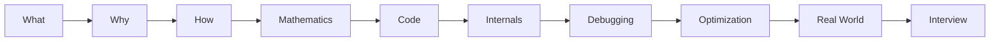

# AI/ML Mastery Program

A complete, deep-dive path from **absolute programming beginner** to **AI/ML engineer / researcher**, written like a stack of textbooks rather than a course.

Every topic in this program is written to move through the same ladder:

## The 15 Books

- **Book 0 — CS Foundations**
  Computers, binary, data structures, algorithms, Big-O.
  [:octicons-arrow-right-24: Start](00-computer-science/index.md)

- **Book 1 — Python**
  Fundamentals through CPython internals, bytecode, and the GIL.
  [:octicons-arrow-right-24: Start](01-python/index.md)

- **Book 2 — Mathematics**
  Linear algebra, calculus, probability — all tied back to ML.
  [:octicons-arrow-right-24: Start](02-mathematics/index.md)

- **Book 3 — Data Engineering**
  NumPy, Pandas, cleaning, feature engineering.
  [:octicons-arrow-right-24: Start](03-data-engineering/index.md)

- **Book 4 — Classical ML**
  Regression, trees, boosting, SVMs — from scratch and with libraries.
  [:octicons-arrow-right-24: Start](04-classical-ml/index.md)

- **Book 5 — ML Theory & Evaluation**
  Bias/variance, metrics, tuning.
  [:octicons-arrow-right-24: Start](05-ml-theory/index.md)

- **Book 6 — Deep Learning**
  Neural nets, backprop, optimizers, from first principles.
  [:octicons-arrow-right-24: Start](06-deep-learning/index.md)

- **Book 7 — Computer Vision**
  CNNs, detection, segmentation, ViTs.
  [:octicons-arrow-right-24: Start](07-computer-vision/index.md)

- **Book 8 — NLP**
  Tokenization through RNNs and attention.
  [:octicons-arrow-right-24: Start](08-nlp/index.md)

- **Book 9 — Transformers & LLMs**
  Attention, GPT/BERT, fine-tuning, LoRA — build one from scratch.
  [:octicons-arrow-right-24: Start](09-transformers-llms/index.md)

- **Book 10 — Generative AI**
  RAG, vector DBs, diffusion.
  [:octicons-arrow-right-24: Start](10-generative-ai/index.md)

- **Book 11 — AI Agents**
  Tool use, planning, memory, multi-agent systems.
  [:octicons-arrow-right-24: Start](11-ai-agents/index.md)

- **Book 12 — MLOps**
  Docker, CI/CD, serving, monitoring, drift.
  [:octicons-arrow-right-24: Start](12-mlops/index.md)

- **Book 13 — AI System Design**
  Design Netflix recs, RAG systems, fraud detection.
  [:octicons-arrow-right-24: Start](13-ai-system-design/index.md)

- **Book 14 — Projects & Interview**
  8 progressive project tiers + interview banks.
  [:octicons-arrow-right-24: Start](14-projects/index.md)

## How each chapter is structured

Every deep-dive chapter follows the same 25-part skeleton (Prerequisites → Big Picture → Intuition → Math → Algorithm → From-scratch code → Library code → Internals → Memory → Edge cases → Debugging → Projects → Interview questions → Mastery ladder), so the depth stays consistent whether you're reading about Python functions or transformer attention.

See [Book 1 → Python Functions](01-python/functions-deep-dive.md) for a fully worked example of the target depth.

!!! mastery "Mastery Ladder"
    Every topic is rated 0–10, from "I've heard the term" to "I can research/modify it." This is tracked per-topic, not per-course — see each chapter's footer.
